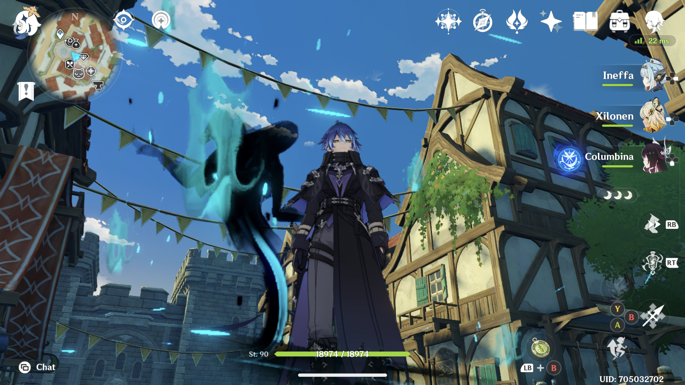
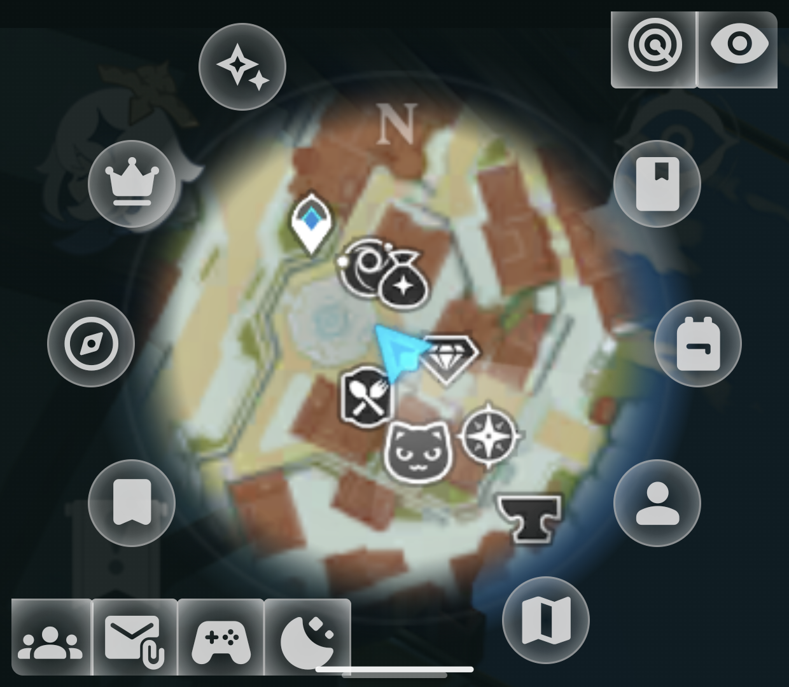
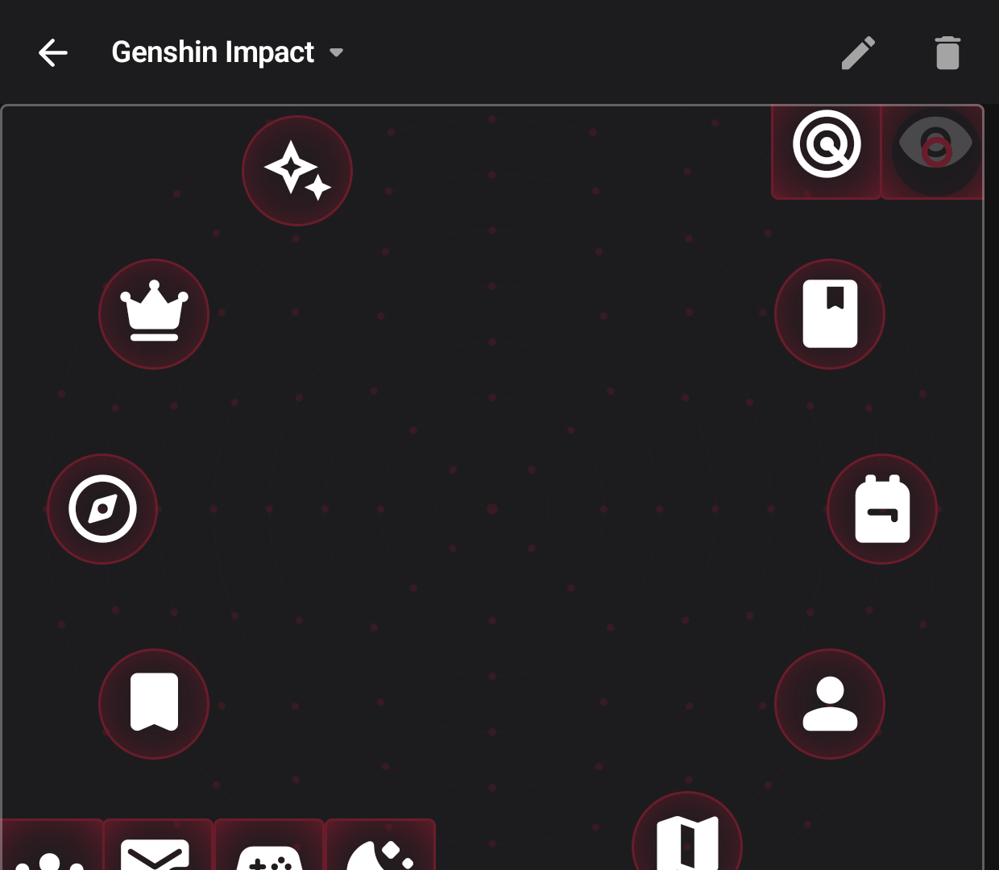
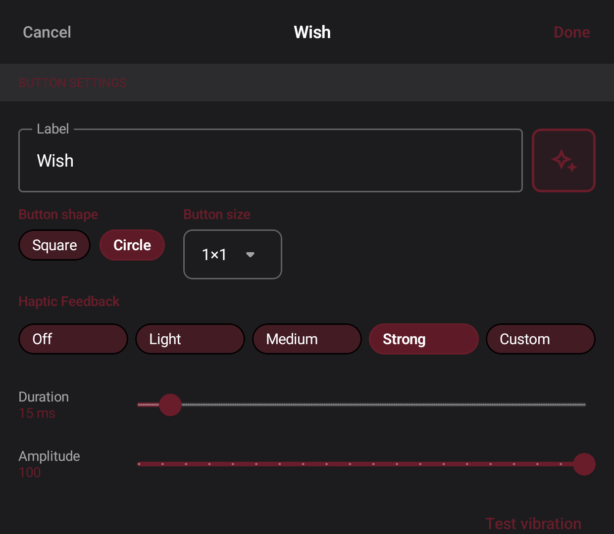
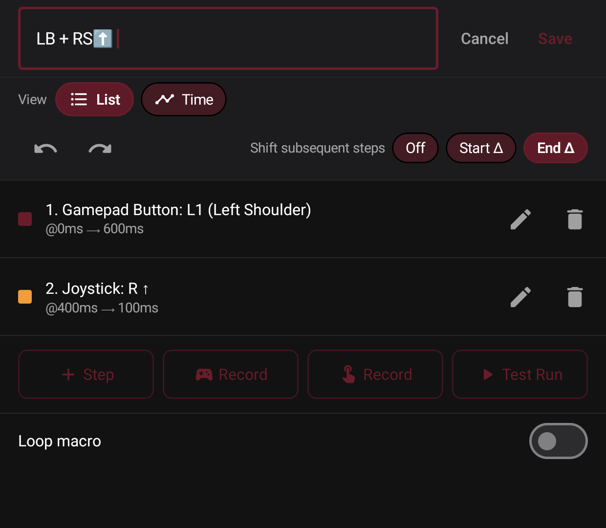
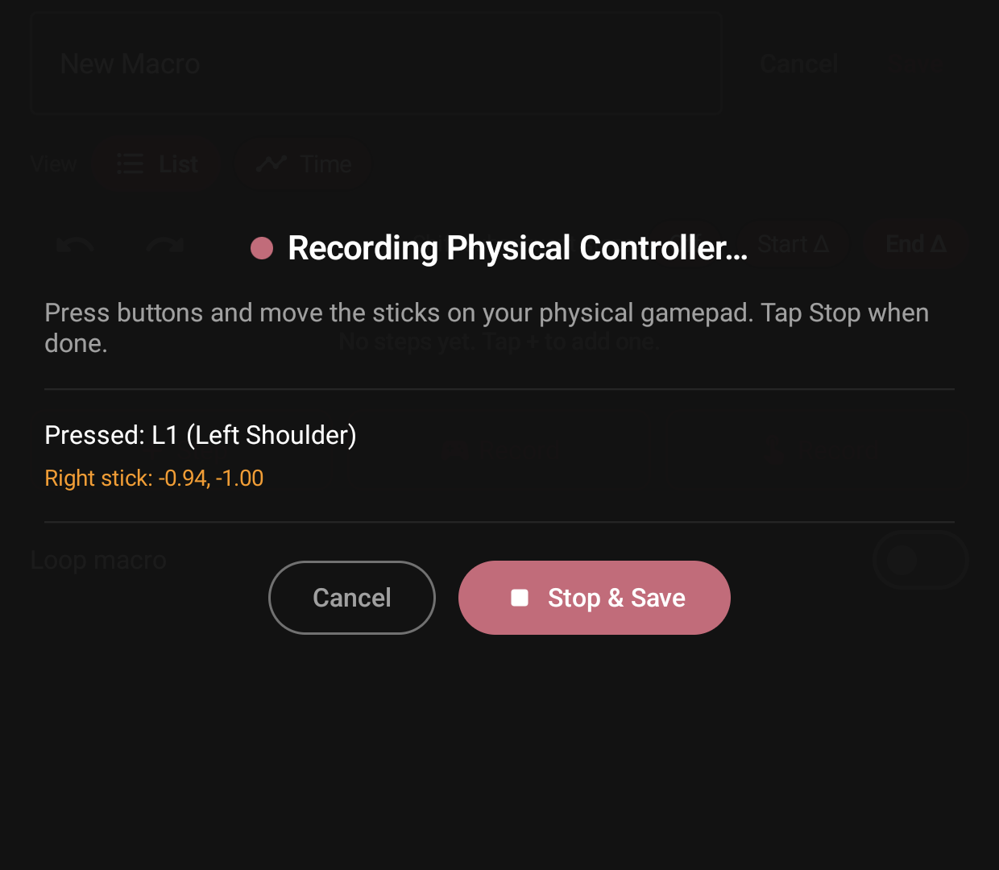
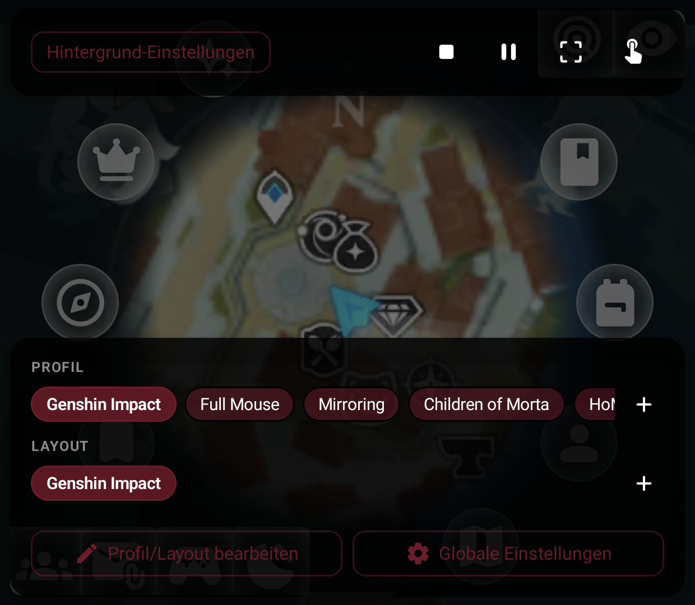
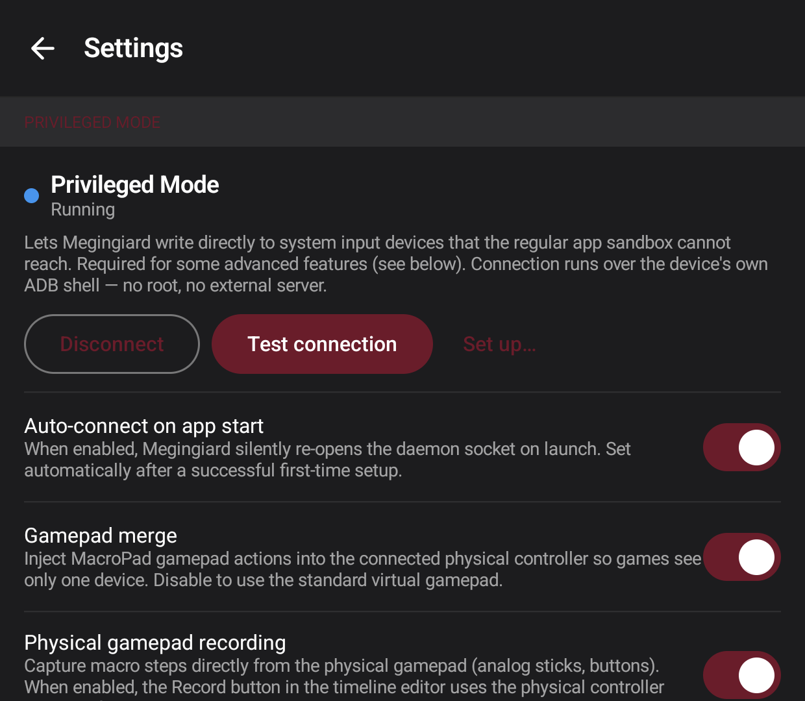

# Megingiard for **AYN Thor**

Welcome to **Megingiard**, a bespoke companion application specifically designed for the **AYN Thor** dual-screen Android handheld. Megingiard combines deep Android hardware video stream manipulation with modern Jetpack Compose interfaces to turn your secondary display into a fully interactive tool belt: a latency-free mirror of your primary screen, a virtual keyboard, a virtual touchpad, a configurable MacroPad, and a virtual gamepad — all driven by native input injection for sub-millisecond response.

---

[Device Compatibility](#device-compatibility) · [Documentation](#documentation) · [Core Features](#core-features) · [Screenshots](#screenshots) · [Installation](#installation) · [Quick Start](#first-launch--quick-start) · [Privileged Mode](#privileged-mode) · [Privacy](#privacy) · [Releases](#releases) · [FAQ & Troubleshooting](#faq--troubleshooting) · [Security](#security) · [License](#license) · [Support This App](#support-this-app) · [Links](#links)

---

## Device Compatibility

- **Target device:** AYN Thor (gaming handheld with two displays)
- **Minimum Android version:** 13 / API 33 (which is what the Thor comes with)
- **Other devices:** Not supported. Megingiard depends on hardware-specific
  paths (`/dev/input/event*`, the secondary display, the AYN Thor input layout)
  that might not exist on other phones or handhelds. Also, I just don't have any
  other dual screen handhelds 😅

---

## Documentation

Given its hardware-specific approach and advanced features, this project is extensively documented:

- **[Requirements](docs/REQUIREMENTS.md):** Functional capabilities and the design constraints under which the app was engineered.
- **[Technical Architecture](docs/ARCHITECTURE.md):** A detailed deep dive into the implementation approaches, focusing specifically on bypassing DRM blocks, rendering Jetpack Compose over native system dialogs (Presentations), and hardware-backed frame freezing.
- **[Security Concept](SECURITY_CONCEPT.md):** Threat model, hardening layers, Privileged Mode authentication, native binary integrity checks, and release configuration requirements.
- **[Agent Guidelines](AGENTS.md):** Coding conventions, patterns, and constraints for AI coding agents working on this project.
- **[Contributing Guidelines](CONTRIBUTING.md):** Architectural rules, styling conventions, and licensing compliance instructions for human contributors.
- **[Manual Verification Guide](docs/MANUAL_VERIFICATION.md):** Step-by-step manual regression tests and PR sanity checklists.

---

## Core Features

### 1. Latency-Free Screen Mirroring
* **Direct Hardware Pipe:** Utilizes Android's `MediaProjection` coupled with native `VirtualDisplay` directly into a `SurfaceView` to bypass all software composition and copy steps.
* **Gallery-Style Pan & Zoom (1× – 5×):** Smart and natural multi-touch gestures with physical boundaries (_Hard Edges_ to prevent vanishing windows) and automatic snap-back when zooming out.
* **Resource-Efficient Freeze Frame:** Physically decouples the video producer from the renderer to freeze the current frame in the hardware buffer. Zoom and pan the frozen reference frame with zero extra CPU or memory overhead.
* **Customizable Controls:** Fully integrate mirror controls (Start / Stop / Freeze / Viewport reset) directly as buttons onto your custom MacroPad layouts, or use the always-present controls in the Pill Menu overlay.

### 2. MacroPad Central Mode
* **Configurable Button Pad:** Create named profiles with multiple custom layouts, featuring free-placement buttons of varying size, shape, and actions.
* **Rich Action Mapping:** Bind buttons to standard keyboard keys, gamepad buttons, mouse buttons, scroll wheels, or trackpoints (relative mouse movement).
* **Robust Layout Editor:** Drag-to-place button layout canvas with rectangular or radial snap grids, and an integrated grid picker backed by the Material Symbols library with over 4,000 icons.
* **Visual Macro Editor & Recorder:** Hand-craft or record and edit timed sequences of key, mouse, and gamepad events. Record macros from on-screen taps or, in Privileged Mode, directly from your physical controller.

### 3. Virtual Keyboard
* **On-Screen Custom Layouts:** Full virtual keyboard offering **QWERTZ / QWERTY / AZERTY** layouts, number row, F1–F12, arrow keys, and standard modifiers.
* **Smart Modifiers:** Tap modifier keys (Shift, Ctrl, Alt, Meta) to make them sticky (one-shot), or long-press to hold.
* **Integrated Trackpoint:** Navigate the mouse cursor on the primary screen directly using a visual trackpoint on the keyboard layout.
* **Kernel Repeat Controls:** Configurable key repeat rate; with repeat disabled, key-up is sent immediately to suppress the kernel's auto-repeat.

### 4. Virtual Touchpad
* **Kernel-Level Mouse Emulation:** Turn the secondary display into a relative trackpad controlling a physical system mouse recognized by Android.
* **Sub-Millisecond Response:** Touch events are injected straight into the kernel input stream via native binaries (`/dev/uinput`) with less than 1ms latency.
* **Multi-Tap Gestures:** Simple and reliable gestures: single tap for Left Mouse Button, double tap for Right Mouse Button, and triple tap for Middle Mouse Button.

### 5. Pill Menu & Immersive UI
* **Always-Visible Edge Pill:** A tiny swipe affordance overlay on the bottom secondary display. Inward swipe opens the Pill Menu, letting you switch profiles/tools, toggle mirroring, or open settings without ever leaving your current layout.
* **Dark Gaming Aesthetics:** Borderless immersive fullscreen styling designed to respect the dark environment of secondary display gaming and prevent distraction from the main screen.

---

## Screenshots

### MacroPad in Action — Genshin Impact Example

| Primary screen | Secondary screen |
| :---: | :---: |
|  |  |

_A custom MacroPad profile built for Genshin Impact. The game runs on the primary screen as usual; the secondary screen hosts a fully configured button layout with gamepad and keyboard actions._

---

### Layout Editor



_The built-in layout editor with rectangular snap grid enabled. Buttons can be placed freely, resized, and snapped to grid for precise alignment._

---

### Button Editor



_Per-button configuration: choose the action type (keyboard key, gamepad button, mouse button, scroll wheel, or trackpoint), pick an icon from the Material Symbols library, and set the button size and shape._

---

### Macro Editor



_The macro editor lets you inspect and fine-tune recorded or hand-crafted event sequences, complete with precise timing control for each step._

---

### Macro Recording



_Macro recording in progress. Tap buttons on the secondary screen (or use your physical controller in Privileged Mode) and Megingiard captures the full event sequence with timing._

---

### Pill Menu



_The Pill Menu — swipe the edge pill inward to switch between Mirror, MacroPad, Keyboard, and Touchpad, change profiles, control the mirror, or open settings. Everything accessible without leaving your current screen._

---

### Privileged Mode Settings



_The Privileged Mode settings card. Each privileged feature — Gamepad Merge, Gamepad Recording, and Privileged Mirror — has its own independent toggle so you can enable only what you need._

---

## Installation

1. Download the latest signed `Megingiard-vX.Y.Z.apk` from the [Releases](../../releases) tab on GitHub.
2. On the AYN Thor, allow your browser or file manager to install unknown apps (Android Settings → Apps → \<your file manager\> → "Install unknown apps").
3. Open the APK to install.
4. Launch the app and start configuring!

There is no Google Play Store listing; APK side-loading is the official distribution channel.

---

## First Launch / Quick Start

1. **Launch the App:** Open Megingiard from your launcher. It only works on the secondary display, so make sure to start it from there or configure your launcher to pin/run it on the bottom screen.
2. **Access Pill Menu:** **Swipe the edge pill** (visible on the bottom edge of the secondary screen) inward. From here, you can:
   - Switch active tools (Mirror, MacroPad, Keyboard, Touchpad).
   - Pick layouts and profiles.
   - Start, freeze, or stop the screen mirror.
   - Open global settings.
3. **Exit App:** Close Megingiard via the standard Android Recents view — there is no in-app exit button to keep your screen completely clear of clutter.

---

## Privileged Mode

Privileged Mode is an **opt-in feature** that unlocks advanced features that the regular Android sandbox cannot deliver due to security constraints. It is **disabled by default** and can be toggled on or off at any time in Global Settings.

### What it is (Technical Details)

Megingiard packages a lightweight, native on-device helper daemon (`megingiard_privd`) inside the APK. When you activate Privileged Mode, the in-app setup wizard leverages Android's built-in **Wireless Debugging** facility (available since Android 11) to deploy the daemon to `/data/local/tmp` and run it under the **shell user** (UID 2000) — the same security domain used by an `adb shell` session. The app then establishes a secure process-local Unix socket connection to communicate with the daemon.

This architecture requires **no root, no USB cables, no PC, and no external servers**. The entire bootstrap runs completely on the device itself through the wizard at the bottom of Global Settings.

### What it unlocks

| Feature | What you gain with Privileged Mode | Fallback without it |
| :--- | :--- | :--- |
| **Gamepad Merge** | Games see only **one** controller, seamlessly blending MacroPad virtual inputs on top of your physical controller. | A second virtual controller appears alongside the physical one. Some games might ignore inputs from one of the devices. |
| **Gamepad Recording** | Record macros from your **real, physical controller** in real-time while the target game continues to receive inputs. | Use the on-screen virtual-controller recording overlay. |
| **Privileged Mirror** | The screen mirror starts instantly without asking for MediaProjection consent every time. | Standard Android screen-recording consent dialog appears on every mirror start. |

### Why it is technically required

The standard Android application sandbox (running in the `untrusted_app` SELinux domain, with no `input` group membership) is strictly prevented from writing to `/dev/uinput` or physical `/dev/input/event*` nodes directly, and cannot initiate system `SurfaceControl` mirror paths. The Android shell UID carries the necessary `input` group permissions and a more permissive SELinux profile, enabling native input injection and projection control.

### Convenience Benefits

* **Auto-Connect:** Once configured, Megingiard silently reconnects to the local daemon on cold starts. No manual pairing or re-pairing is needed.
* **No Recurring Prompts:** The Privileged Mirror skips the OS screen capture warning completely on every launch.
* **Per-Feature Toggles:** Choose exactly which features to run under Privileged Mode and which to run in fallback.
* **⚠️ Daemon Lifespan:** The daemon will **not** survive a device reboot because Android clears `/data/local/tmp` on startup. You will need to re-run the pairing wizard (takes less than 30 seconds) after booting.

### Security and Trust

Privileged Mode is powerful, and you should understand its security scope:
- **Shell-Level Scope (UID 2000):** The daemon runs with the same rights as `adb shell`. It can read/write input nodes to emulate controllers and keys, but **cannot** escalate to root, modify system/read-only partitions, or read private data belonging to other applications.
- **Trusted Sources Only:** Only run Privileged Mode if you trust the source code and signed releases. **ONLY DOWNLOAD THE APK FROM THE OFFICIAL GITHUB RELEASES PAGE.**
- **Completely Local & Offline:** The Wireless Debugging pairing is a local loopback handshake. The daemon only listens on a process-local **abstract Unix socket** inaccessible from any external network. Megingiard makes no outbound network connections.
- **Easy Opt-Out:** You can disable Privileged Mode at any time. All features gracefully degrade to their standard sandbox fallbacks.

### Verifying the APK Download

Each release includes a SHA-256 checksum file (e.g. `Megingiard-vX.Y.Z-checksum-sha256.txt`). Verify the hash of your downloaded APK before installation to ensure its integrity.

**macOS**
```sh
shasum -a 256 Megingiard-vX.Y.Z.apk
```

**Linux**
```sh
sha256sum Megingiard-vX.Y.Z.apk
```

**Windows (PowerShell)**
```powershell
Get-FileHash Megingiard-vX.Y.Z.apk -Algorithm SHA256 | Select-Object -ExpandProperty Hash
```

Ensure the output matches the checksum in the `.txt` file exactly before sideloading. For absolute authenticity, always verify the developer's signing certificate fingerprint.

### Pairing Wizard Steps

1. Go to Android Settings → System → Developer Options, and enable **Wireless Debugging**.
2. Tap **"Pair device with pairing code"** — Android will show an IP address, port, and a 6-digit pairing code.
3. Enter the port and pairing code into Megingiard's setup wizard.
4. The wizard pairs with the local ADB service, deploys the daemon, launches it, and runs a self-test.
5. Tap **Test Connection** in Settings at any time to verify the socket link is active.

---

## Privacy

* **No Analytics or Telemetry:** Megingiard collects nothing, logs nothing externally, and sends nothing. Your device data is entirely yours.
* **No Internet Required:** The local pairing stays on the device's loopback interface. Megingiard makes zero external internet calls.
* **Local Storage:** All custom profiles, layout setups, and macros are stored strictly on-device using Jetpack DataStore.

---

## Releases

* Releases are officially tagged `vMAJOR.MINOR.PATCH` and published in the GitHub [Releases](../../releases) tab.
* Each release bundle includes:
  - The signed production APK (`Megingiard-vX.Y.Z.apk`)
  - The MD5 verification checksum file
  - Detailed changelogs organized by feature area and daemon changes
* Pre-releases are clearly labeled and carry `-beta` or `-rc` suffixes.

---

## FAQ & Troubleshooting

**The mirror screen is black.**
> Try stopping and restarting the mirror from the Pill Menu. If the screen remains black, open a GitHub issue specifying your current app version and replication steps.

**Android requests screen recording permission on every mirror start.**
> This is default Android behavior. Enable Privileged Mode and turn on the **Privileged Mirror** feature in Settings to skip this prompt permanently.

**Privileged Mode shows "OFF" after I rebooted my Thor.**
> This is expected. Android wipes `/data/local/tmp` on reboots. Sideloaded daemons cannot autostart on boot without root. Simply re-run the pairing wizard (takes ~30 seconds).

**My game sees two controllers when using the MacroPad.**
> Enable Privileged Mode and turn on **Gamepad Merge**. This merges the MacroPad's virtual actions onto your physical controller's stream, hiding the double controller from the game.

**Only MacroPad buttons or only physical gamepad inputs are registered, not both.**
> Some Android games only accept a single active input source. Enabling **Gamepad Merge** under Privileged Mode resolves this.

**Wireless Debugging pairing fails.**
> Ensure you enter the **pairing port** (shown in the popup pairing code dialog) and not the connection port (shown on the main Wireless Debugging screen). These are two different, dynamic five-digit numbers.

**Deploying the daemon fails.**
> Sometimes the local ADB loopback handshake takes a few extra seconds to initialize. Try running the test/deploy step 1 or 2 more times — this always resolves transient socket connection timeouts.

**Can I run this on other dual-screen devices or phones?**
> No. Megingiard targets the specific screen geometry, hardware-specific mapping paths, and physical event codes of the AYN Thor. It will not work on different hardware configurations.

---

## Security

Megingiard combines APK signature pinning, release-build fail-closed checks, SHA-256 verification of native assets, and mutual HMAC-SHA256 authentication for the Privileged Mode daemon socket. The concise entry point is [SECURITY_CONCEPT.md](SECURITY_CONCEPT.md); detailed daemon and native-binary behavior is documented in [Privileged Mode](docs/features/privileged-mode/FEATURE.md#security-model) and [Build Native](docs/BUILD_NATIVE.md#native-asset-integrity).

---

## License

Megingiard is a proprietary, source-available project. It is licensed under the custom **Megingiard Source-Available License (Version 1.0)**.

* **Source Code & Binaries:** You are permitted to view the source code, compile it, and run the application solely for your own **personal, non-commercial use**.
* **Prohibitions:** Any commercial exploitation, redistribution of modified source/binaries, and pre-installation or bundling on commercial hardware/devices without prior written consent are strictly prohibited.

For the full terms and conditions, please refer to the [LICENSE](LICENSE) file at the root of the repository.

---

## Support This App

Megingiard is completely free to use for personal, non-commercial use. If you enjoy using it and want to support its ongoing development, feel free to buy me a non-existent coffee! Your support and feedback are highly appreciated. <3

[](https://ko-fi.com/stormpanda)

---

## Links

* Are you creating videos, guides, or posts featuring Megingiard? Reach out, and I will gladly feature your content right here!

---

_Developed on the edge of the Android Graphics Architecture._
